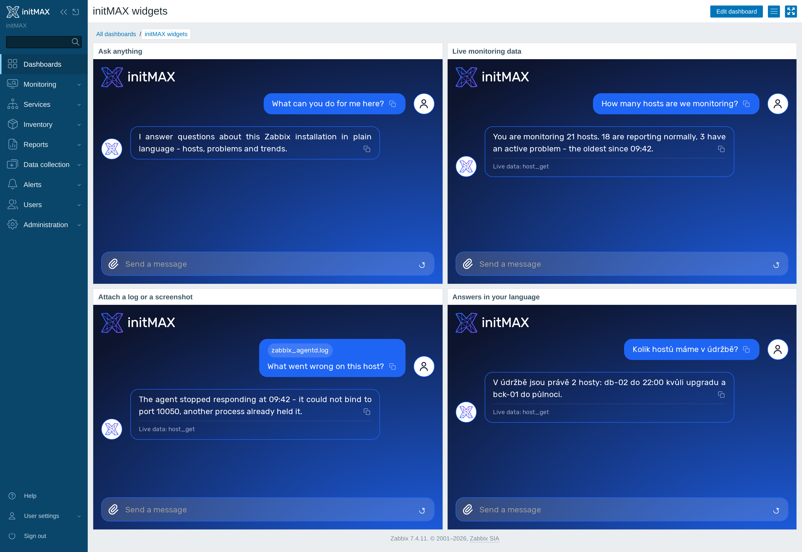
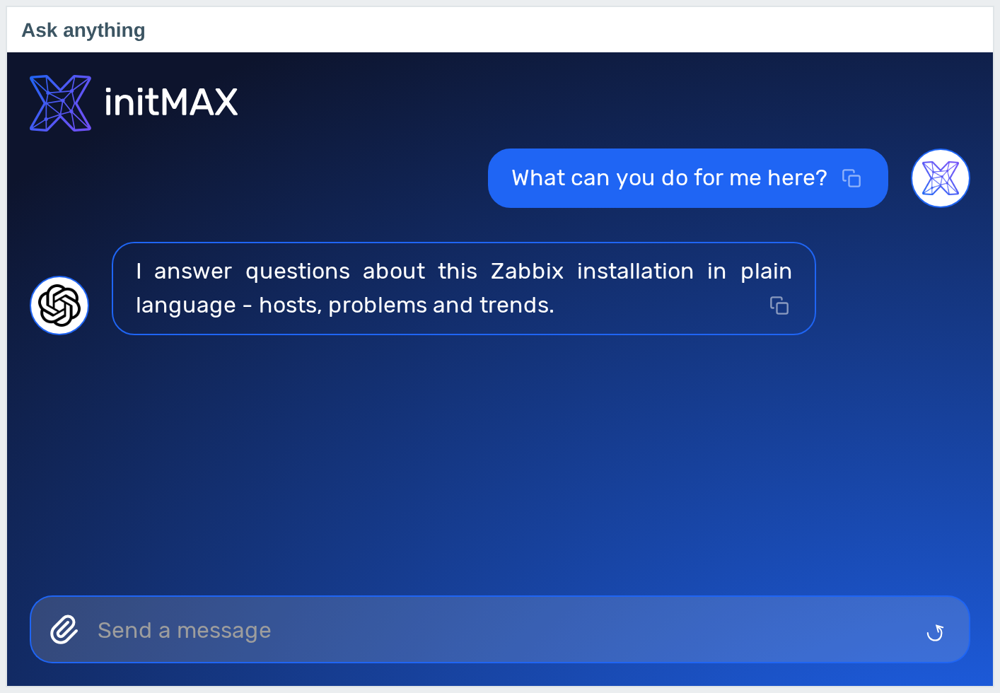
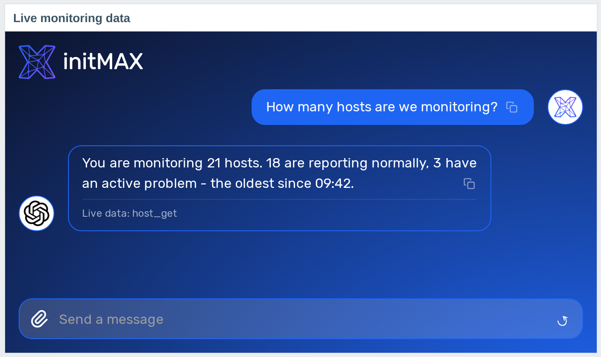
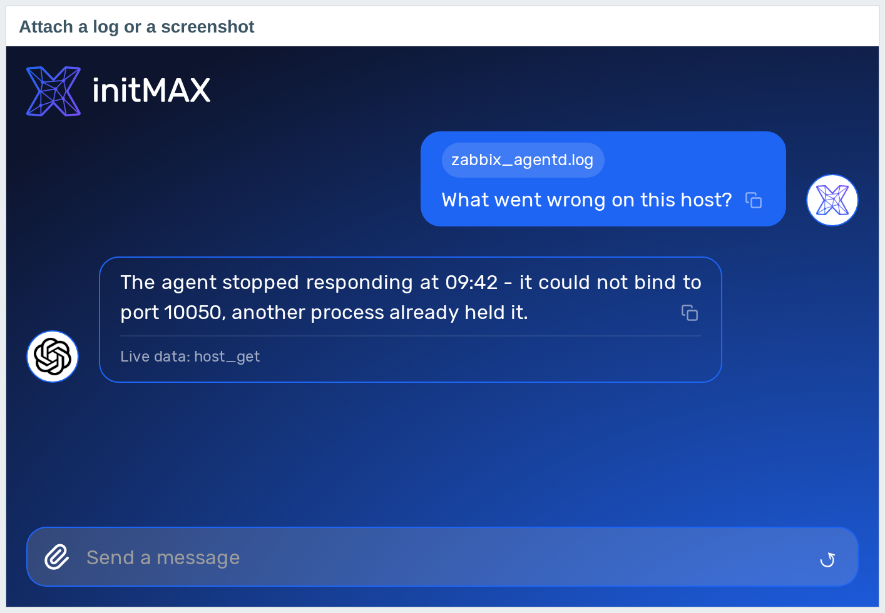
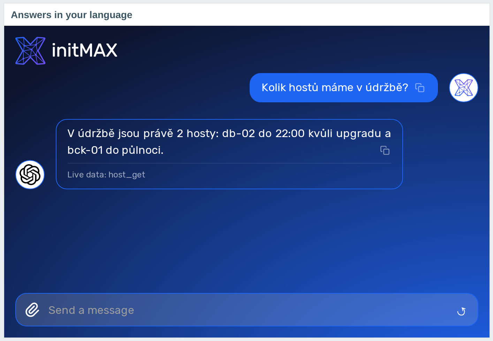
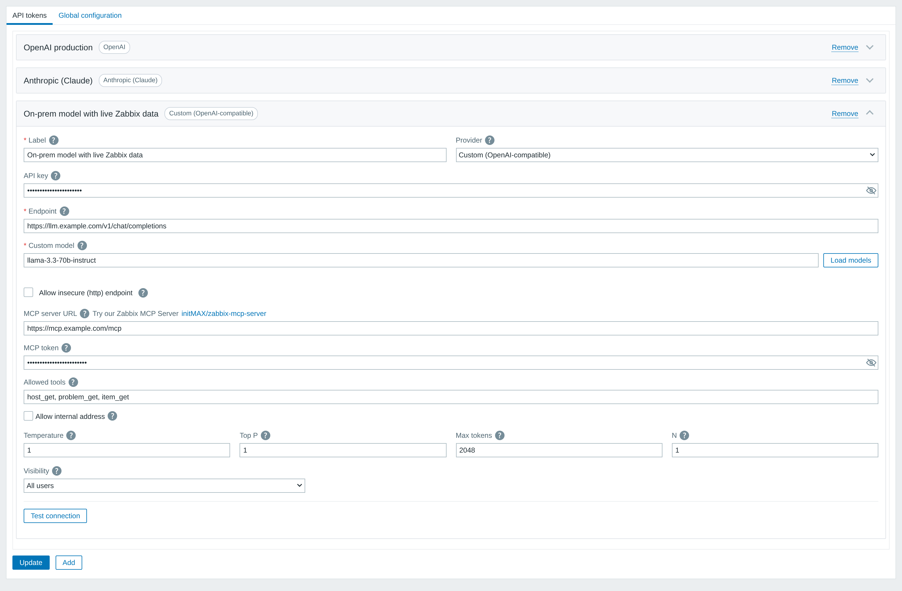
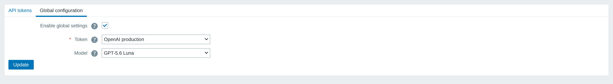
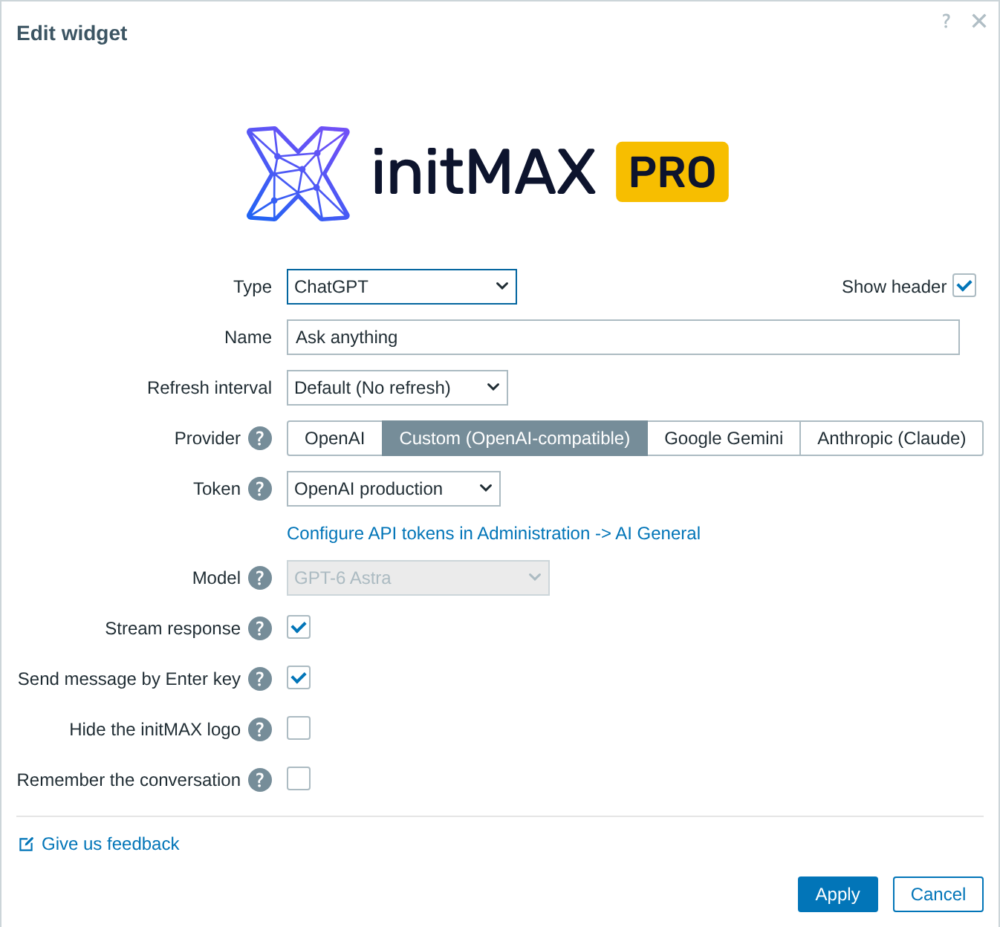
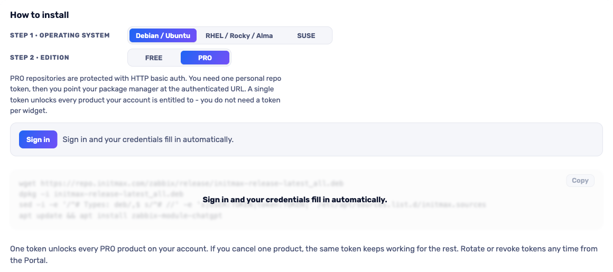

<h1>ChatGPT</h1>

developed and maintained by

and community

<strong>An AI chat widget for Zabbix dashboards.</strong> 
Ask about your infrastructure without leaving the board - a server-proxied chat with OpenAI, Gemini, Claude or your own OpenAI-compatible endpoint, with admin-managed API keys that never reach the browser.

<a href="#what-you-can-build"><strong>Features</strong></a> &nbsp;·&nbsp;
<a href="#examples"><strong>Examples</strong></a> &nbsp;·&nbsp;
<a href="#install"><strong>Install</strong></a> &nbsp;·&nbsp;
<a href="#free-vs-pro"><strong>FREE vs PRO</strong></a> &nbsp;·&nbsp;
<a href="https://portal.initmax.com"><strong>Portal</strong></a> &nbsp;·&nbsp;
<a href="https://www.initmax.com/wiki/chatgpt/"><strong>Docs</strong></a>

 

---

## Why ChatGPT

Troubleshooting means switching between the dashboard and a chat window - and pasting company context into a personal AI account. **ChatGPT** puts the assistant on the dashboard itself: your admin provisions the API keys once (with per-team visibility), every request is proxied by the Zabbix server, and the raw key never travels to a browser.

## What you can build

<table>
<tr>
<td width="50%" valign="top">

**On-call assistant**
Ask "what does this trigger mean" or "how do I check disk latency" right next to the problem list.

</td>
<td width="50%" valign="top">

**Managed keys**
Admin-provisioned API tokens with visibility scopes - everyone / user groups / specific users.

</td>
</tr>
<tr>
<td width="50%" valign="top">

**Runbook drafting**
Turn a resolved incident into a first-draft runbook without leaving Zabbix.

</td>
<td width="50%" valign="top">

**Any provider** &nbsp;PRO
OpenAI, Google Gemini, Anthropic Claude - or a self-hosted OpenAI-compatible endpoint (Ollama, vLLM).

</td>
</tr>
<tr>
<td width="50%" valign="top">

**Org-wide defaults** &nbsp;PRO
Lock every widget to one company-approved token and model from Administration.

</td>
<td width="50%" valign="top">

**Tuning per token** &nbsp;PRO
Temperature, top-p, max tokens and N - set once on the token, applied everywhere it is used.

</td>
</tr>
</table>

## Examples

<table>
<tr>
<td width="50%" align="center" valign="top"> <small><b>Streamed answers</b> - markdown-rendered, token by token</small></td>
<td width="50%" align="center" valign="top"> <small><b>Live monitoring data</b> - the model queries your Zabbix through MCP and says which tool it used</small></td>
</tr>
<tr>
<td width="50%" align="center" valign="top"> <small><b>Attachments</b> - drop in a log or a screenshot and ask about it</small></td>
<td width="50%" align="center" valign="top"> <small><b>Your language</b> - ask in any language, the answer comes back in it</small></td>
</tr>
<tr>
<td width="50%" align="center" valign="top"> <small><b>Managed tokens</b> - endpoint, MCP server and visibility per user group or user</small></td>
<td width="50%" align="center" valign="top"> <small><b>Org-wide default</b> - one connection for every widget on every dashboard</small></td>
</tr>
</table>

## Configuration

The widget form is deliberately small - pick a **provider**, one of the **admin-managed tokens** and a **model**; everything sensitive (the key, a custom endpoint, tuning parameters) lives on the token under **Administration → AI General**. PRO-only fields show inline (greyed with a padlock in the FREE edition).

## Install

Both **FREE** and **PRO** ship as **GPG-signed `deb` / `rpm` packages** from the initMAX repository - `apt` / `dnf` installs them and keeps them updated. Same flow for both editions; PRO just adds your personal repo token.

### Easiest way - the guided installer on the Portal

Open the product page, pick your **OS** and **edition**, and copy the ready-made command. FREE is fully public (no login); PRO fills in your token once you sign in. There's a feedback box right there too.

<a href="https://portal.initmax.com/catalog/zabbix-chatgpt#how-to-install"><strong>→ Open the installer on the Portal</strong></a>

Prefer a plain archive? Every release also ships as a **ZIP** - FREE [straight from the repo](https://repo.initmax.com/zabbix/free/zip/chatgpt/), PRO with your repo token - handy for offline or manual installs.

Then enable it in **Administration → General → Modules**, add an API token under **Administration → AI General**, and drop the widget on a dashboard. Done.

## Supported AI models

The curated model list ships in the package (`models.yaml`) and is kept in sync with the live provider APIs by the initMAX release pipeline.

| Provider | Models |
| -------- | ------ |
| **OpenAI** | GPT-5.6 Luna · GPT-5.6 Sol · GPT-5.6 Terra · GPT-5.5 · GPT-5.5 Pro · GPT-5.4 · GPT-5.4 Mini · GPT-5.4 Nano · GPT-5.4 Pro |
| **Google Gemini** | Gemini Flash (latest) · Gemini Pro (latest) · Gemini Flash Lite (latest) · Gemini 3 Pro · Gemini 3 Flash · Gemini 3.6 Flash · Gemini 3.5 Flash · Gemini 3.5 Flash Lite · Gemini 3.1 Flash Lite · Gemini 2.5 Pro |
| **Anthropic (Claude)** | Claude Opus 5 · Claude Sonnet 5 · Claude Opus 4.8 · Claude Sonnet 4.6 · Claude Haiku 4.5 |
| **Custom** | any OpenAI-compatible endpoint (Ollama, vLLM, LiteLLM, ...) with a free-text model id |

## FREE vs PRO

| Feature                                                       |  FREE  |  PRO   |
| ------------------------------------------------------------- | :----: | :----: |
| AI chat on the dashboard (server-proxied, key never in browser) |  Yes   |   Yes   |
| Localised into all 25 Zabbix display languages            |   ✅   |   ✅   |
| High availability ready                                   |   ✅   |   ✅   |
| Admin-managed API tokens with visibility scopes               |  Yes   |   Yes   |
| Streamed, markdown-rendered answers (sanitized)               |  Yes   |   Yes   |
| Follow-latest scrolling with a return-to-latest control       |  Yes   |   Yes   |
| OpenAI on the newest supported model                          |  Yes   |   Yes   |
| Send-by-Enter &amp; streaming toggles                             |  Yes   |   Yes   |
| Upgrade-safe field schema (Zabbix 6.x → 7.x)                  |  Yes   |   Yes   |
| **Provider choice - OpenAI · Gemini · Claude**                |   -    |  Yes   |
| **Custom OpenAI-compatible endpoint** (Ollama, vLLM, …)       |   -    |  Yes   |
| **Model selection** from the curated per-provider list        |   -    |  Yes   |
| **Tuning parameters per token** (temperature · top-p · max tokens · N) |   -    |  Yes   |
| **Org-wide global configuration** (one token for all widgets) |   -    |  Yes   |
| **Live Zabbix data through MCP tools**                            |   -    |  Yes   |
| **Attachments** (screenshots, logs and config files)              |   -    |  Yes   |
| **Remember conversation per user in the database**                |   -    |  Yes   |
| **Stop generation &amp; copy controls**                           |   -    |  Yes   |
| **Hide the initMAX logo**                                     |   -    |  Yes   |
| Licence                                                       | AGPLv3 | [Commercial](./LICENSE-PRO.md) |

## Requirements

|              |                                                              |
| ------------ | ------------------------------------------------------------ |
| **Zabbix**   | 6.0 · 6.2 · 6.4 · 7.0 · 7.2 · 7.4 - one package covers all    |
| **PHP**      | 7.4 or newer                                                 |
| **OS**       | Debian/Ubuntu · RHEL/Rocky/Alma/Oracle/Amazon · SUSE         |
| **Editions** | FREE (public repo) · PRO (token-gated repo)                  |
| **Languages** | All 25 Zabbix display languages - the widget follows each user's own language setting |
| **High availability** | Ready. Conversations and admin tokens live in the Zabbix database, never on the node, so any frontend of an HA cluster can serve the next request |

## Support &amp; links

- **[Documentation / Wiki](https://www.initmax.com/wiki/chatgpt/)**
- **[Product page](https://www.initmax.com/product/chatgpt/)**
- **[Portal](https://portal.initmax.com)** - downloads, tokens, support tickets
- **Source code (FREE, AGPLv3)** - included in every package and published as a [source archive](https://repo.initmax.com/zabbix/free/zip/chatgpt/) on repo.initmax.com
- **[support@initmax.com](mailto:support@initmax.com)**

---

FREE: <a href="https://www.gnu.org/licenses/agpl-3.0.html">AGPLv3</a> &nbsp;·&nbsp; PRO: <a href="./LICENSE-PRO.md">commercial</a> &nbsp;·&nbsp; © 2021-2026 initMAX s.r.o.

