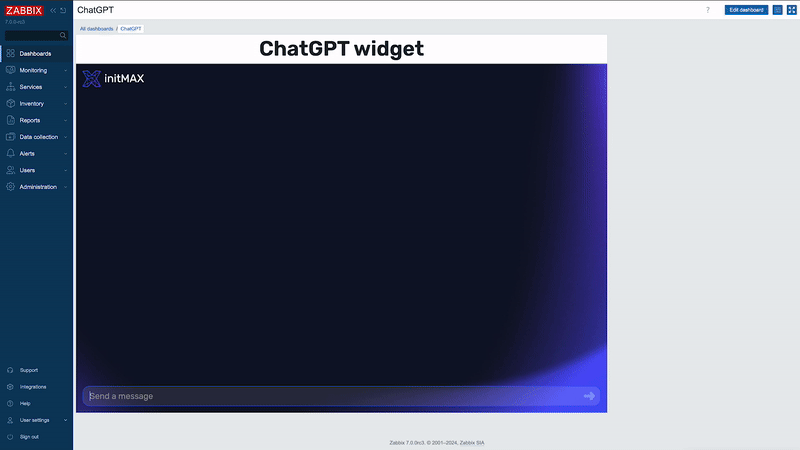
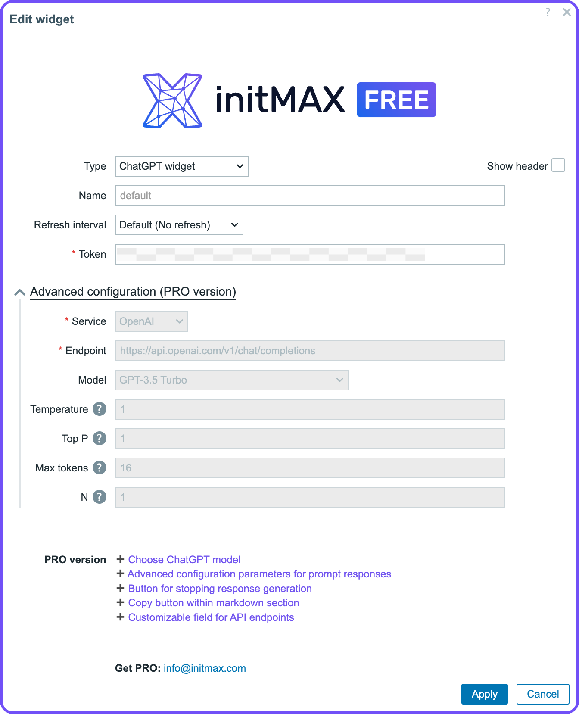
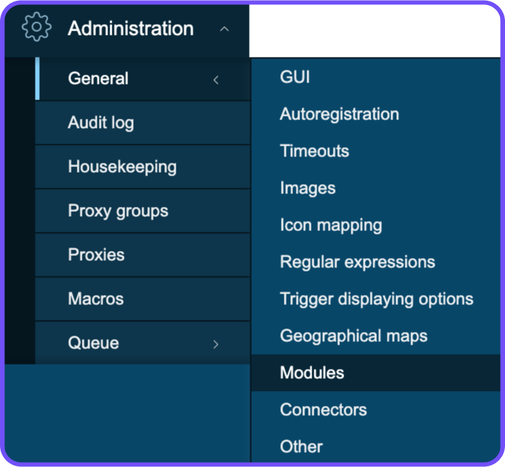
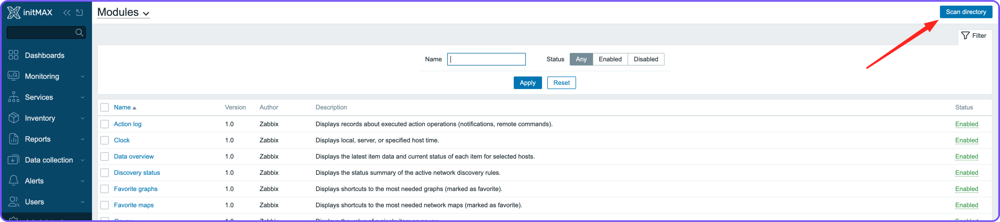
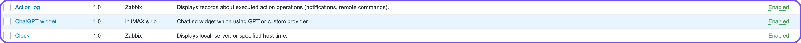

<!-- *********************************************************************************************************************************** -->
<!-- *** HEADER ************************************************************************************************************************ -->
<!-- *********************************************************************************************************************************** -->
<div align="center">
    <a href="http://www.initmax.com"></a>
    <h3>
        <span>
            Honesty, diligence and MAXimum knowledge of our products is our standard.
        </span>
    </h3>
    <h3>
        <a href="https://www.initmax.com/">
            
        </a>&nbsp;
        <a href="https://www.linkedin.com/company/initmax/">
            
        </a>&nbsp;
        <a href="https://www.youtube.com/@initmax1">
            
        </a>&nbsp;
        <a href="https://www.facebook.com/initmax">
            
        </a>&nbsp;
        <a href="https://www.instagram.com/initmax/">
            
        </a>&nbsp;
        <a href="https://twitter.com/initmax">
            
        </a>&nbsp;
        <a href="https://github.com/initmax">
            
        </a>
    </h3>
    <h3>
        <a></a>&nbsp;&nbsp;&nbsp;
        <a></a>
    </h3>
</div>
<br>
<br>

---
---

<div align="center">
    <h1>
        ChatGPT <!-- !!! change version !!! -->
    </h1>
    <h4>
        The ChatGPT widget integrates AI capabilities into your Zabbix dashboard, allowing interaction with OpenAI models directly from the widget.<!-- !!! change version !!! -->
    </h4>
    <br>
     <!-- !!! change version !!! -->
     <!-- !!! change version !!! -->
    <h3>
        <a href="#requirements">Requirements</a> •
        <a href="#description">Description</a> •<!-- !!! change list !!! -->
        <a href="#editions">Editions</a> •
        <a href="#installation">Installation</a>
    </h3>
    <br>
     <!-- !!! change version !!! -->
</div>
<br>
<br>

<!-- *********************************************************************************************************************************** -->
<!-- *** BODY ************************************************************************************************************************** -->
<!-- *********************************************************************************************************************************** -->
## Requirements

- Zabbix 7.0
- You need to create OpenAI API token https://platform.openai.com/docs/introduction/overview

<!-- *********************************************************************************************************************************** -->
<br>

## Description
The ChatGPT widget integrates AI capabilities into your Zabbix dashboard, allowing interaction with OpenAI models directly from the widget.

<br>
<div align="center">
    
</div>

<!-- *********************************************************************************************************************************** -->
<br>
<br>

## Editions

<div align="center">

| Function                                         | FREE   | PRO        |
|--------------------------------------------------|:------:|:----------:|
| Set own OpenAI token                             | ✅     | ✅         |
| Choose ChatGPT model                             | ❌     | ✅         |
| Advanced configuration parameters for prompt responses | ❌     | ✅         |
| Button for stopping response generation          | ❌     | ✅         |
| Copy button within markdown section              | ❌     | ✅         |
| Customizable field for API endpoints             | ❌     | ✅         |

<h3>
    Get the PRO version at <a href="mailto:info@initmax.com?subject=Inquiry%20ChatGPT%20widget%20PRO%20version">info@initmax.com</a>
</h3>
</div>

<!-- *********************************************************************************************************************************** -->
<!-- *** Installation ************************************************************************************************************************** -->
<!-- *********************************************************************************************************************************** -->
## Installation
- Connect to your Zabbix frontend server (perform on all frontend nodes)

- Navigate to the `ui/modules/` directory (`ui` is typically located at `/usr/share/zabbix/`)
    ```sh
    cd /usr/share/zabbix/modules/
    ```

- Clone repository on your server <!-- !!! repository !!! -->
    ```sh
    git clone https://git.initmax.cz/initMAX-Public/zabbix-chatgpt-widget.git
    ``` 

- Change the owner of directory to your web user with `chown`
  - default OS users
    - nginx
        ```sh
        chown nginx:nginx ./zabbix-chatgpt-widget
        ``` 
    - apache (RHEL)
        ```sh
        chown apache:apache ./zabbix-chatgpt-widget
        ``` 
    - apache (DEB)
        ```sh
        chown www-data:www-data ./zabbix-chatgpt-widget
        ``` 

- Go to Zabbix frontend menu -> Administration -> General -> Modules
<div align="center">
    
</div>

- Use the Scan directory button on the top
<div align="center">
    
</div>

- Enable the newly discovered module
<div align="center">
    
</div>

- Done
<div align="center">
    
</div>

- Use it and enjoy!

<!-- *********************************************************************************************************************************** -->
<!-- *** FOOTER ************************************************************************************************************************ -->
<!-- *********************************************************************************************************************************** -->
<br>
<br>

---
---
<div align="center">
    <h4>
        <a href="https://www.initmax.com/">
            
        </a>
        <a href="tel:+420800244442">
            
        </a>
        <a href="mailto:info@initmax.com">
            
        </a>
        <br>
        <a href="https://www.linkedin.com/company/initmax/">
            
        </a>&nbsp;
        <a href="https://www.youtube.com/@initmax1">
            
        </a>&nbsp;
        <a href="https://www.facebook.com/initmax">
            
        </a>&nbsp;
        <a href="https://www.instagram.com/initmax/">
            
        </a>&nbsp;
        <a href="https://twitter.com/initmax">
            
        </a>&nbsp;
        <a href="https://github.com/initmax">
            
        </a>
        <br><br><br>
        <a>
            
        </a>
    </h4>
</div>